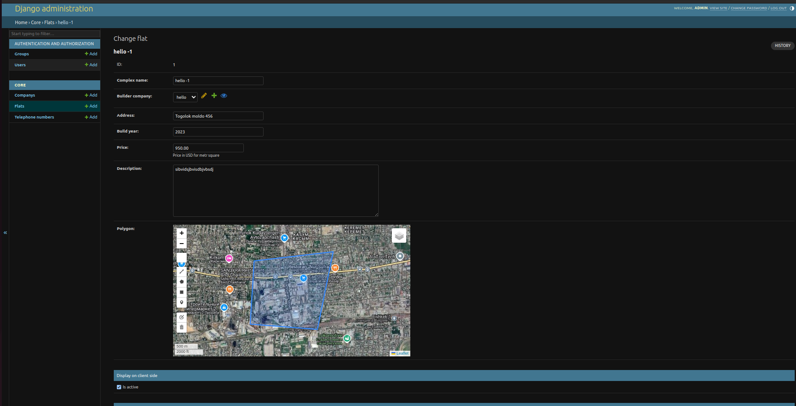

# Project Apartments using GeoDjango and Django Leaflet libraries

## Development setup
### Prerequisites

- Python 3.10
- Docker

### Environment variables

The web backend expects the following environment variables to be set:
- `POSTGRES_DB`
- `POSTGRES_PASSWORD`
- `POSTGRES_USER`
- `POSTGRES_HOST`
- `POSTGRES_PORT`
- `SECRET_KEY`

### Setup
#### Coppy project to your device using SSH
```
git clone git@github.com:TIP-ROK/appartments-GeoDjango.git
```
#### Run project
```
docker-compose up -d --build
```
#### Creating super admin
```
docker-compose exec web ./manage.py createsuperuser
```
### Admin panel
